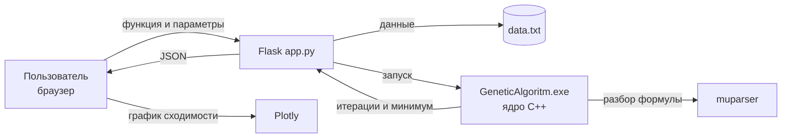

<h1 align="center">Оптимизатор функций</h1>


<h2 align="center">ДЕМО-версия</h2>
<h2 align="center">https://vanyagin.github.io/GeneticOptimizer/</h2>

<p align="center">
  Поиск глобального минимума непрерывных многомерных функций<br>
  методами <b>дифференциальной эволюции (jDE)</b> и <b>оптимизации китов (WOA)</b>
  с веб-интерфейсом и установщиком под Windows.
</p>

<p align="center">
  
  
  
  
  
</p>

---

## О проекте

Программа находит глобальный минимум функции вида `f(x₀, x₁, …, xₙ)` на заданных
диапазонах переменных. Вычислительное ядро написано на **C++17**, а поверх него
работает лёгкий **веб-интерфейс** на Python/Flask: пользователь вводит функцию в
браузере, а программа возвращает найденную точку минимума и строит **график
сходимости**.

## Возможности

- Два алгоритма оптимизации: самоадаптивная дифференциальная эволюция **jDE** и
  алгоритм оптимизации китов **WOA**.
- Ввод произвольной функции от многих переменных прямо в браузере.
- Настраиваемые диапазоны переменных и параметры алгоритма.
- Интерактивный график сходимости (Plotly, работает офлайн).
- Режим «внешний `.exe`»: оптимизация целевой функции, заданной отдельной программой.

## Быстрый старт

### Вариант 0. Портативная версия
1. Распаковать `GeneticOptimizer-portable.zip` в любую папку.
2. Запустить `run.bat`.

Откроется браузер со страницей оптимизатора по адресу
`http://127.0.0.1:5000`. Чтобы выйти — закрыть появившееся консольное окно.

### Собрать установщик самому
Установщик и портативный архив собираются одним скриптом на машине с интернетом:
```
cd installer
build.bat
```
Скрипт скачает встроенный Python, подготовит окружение и соберёт
`GeneticOptimizer-Setup.exe` и `GeneticOptimizer-portable.zip`.
Подробности — в [`installer/README.txt`](installer/README.txt).

## Архитектура



Веб-слой только готовит входные данные и запускает ядро; вся оптимизация
происходит в C++.

## Алгоритмы

### Дифференциальная эволюция (jDE)
Самоадаптивный вариант DE со стратегией мутации **current-to-pbest/1**:

```
v = x + F·(pbest − x) + F·(r1 − r2)
```

- Скрещивание — бинарное, с гарантированным индексом обмена.
- Параметры `F` и `CR` адаптируются для каждой особи с вероятностью `τ = 0.1`:
  новые значения `F ∈ [0.1, 0.9]`, `CR ∈ [0, 1]`; принимаются только при улучшении.
- `pbest` выбирается из лучших `p = 10%` популяции.

### Алгоритм оптимизации китов (WOA)
Метаэвристика, имитирующая охоту горбатых китов «пузырьковой сетью»
(окружение добычи и спиральное движение). Подходит для сравнения с jDE на тех же задачах.

## Запуск ядра из консоли

Ядро можно использовать и без веб-интерфейса:

```
GeneticAlgoritm.exe <Algorithm> <Type> <N> <PopulationSize> <F> <CR> <E> <Iterations>
```

| Аргумент | Описание |
|----------|----------|
| `Algorithm` | `de` — дифференциальная эволюция; `woa` — алгоритм китов |
| `Type` | `file` — читать функцию из `data.txt`; имя `.exe` — режим внешней функции |
| `N` | Число параметров (игнорируется в режиме `file`) |
| `PopulationSize` | Размер популяции (≥ 4 для DE, ≥ 2 для WOA) |
| `F` | Начальный масштабирующий коэффициент DE (jDE адаптирует) |
| `CR` | Начальная вероятность скрещивания DE (jDE адаптирует) |
| `E` | Точность: цель сходимости `10⁻ᴱ` |
| `Iterations` | Максимум поколений |

Пример:
```
GeneticAlgoritm.exe de file 0 30 0.65 0.5 5 200
```

## Формат функции

Переменные обозначаются `x0`, `x1`, `x2`, … (нумерация с нуля, без пропусков).
Поддерживаются операторы `+ - * /`, степень `^`, скобки, а также `sin`, `cos`,
`exp`, `log`, `sqrt`, `abs` и др. (разбор через muparser). Файл `data.txt`:

```
(x0^2 + x1 - 11)^2 + (x0 + x1^2 - 7)^2
x0: -5 5
x1: -5 5
```

Примеры функций:

| Функция | Выражение |
|---------|-----------|
| Химмельблау | `(x0^2 + x1 - 11)^2 + (x0 + x1^2 - 7)^2` |
| Розенброк | `100*(x1 - x0^2)^2 + (1 - x0)^2` |
| Сфера (3D) | `x0^2 + x1^2 + x2^2` |

## Режим внешнего `.exe`

Целевую функцию можно задать отдельной программой. Ядро для каждой проверяемой
точки записывает координаты в `data2.txt` (по одному числу на строке), запускает
ваш `.exe`, и читает результат — одно число — из `res.txt`. Диапазон каждого
аргумента фиксирован: `[-5, 5]`.

## Сборка из исходников

**Требуется:** Visual Studio 2022 (набор «Разработка на C++», MSVC v143).
Библиотека **muparser** уже включена в репозиторий (`muparser/`).

1. Открыть `GeneticAlgoritm.sln`.
2. Выбрать конфигурацию **Release | x64**.
3. Собрать — рядом появится `GeneticAlgoritm.exe`, `muparser.dll` копируется автоматически.

## Структура репозитория

```
GeneticAlgoritm/
├─ GeneticAlgoritm/            # исходники ядра (C++) и веб-приложения
│  ├─ de/                      #   DifferentialEvolution.h, WhaleOptimization.h, TestFunctions.h
│  ├─ app.py                   #   веб-интерфейс (исходная dev-версия)
│  ├─ static/ · templates/     #   фронтенд
│  └─ GeneticAlgoritm.cpp      #   main(): разбор аргументов, диспетчеризация
├─ installer/                  # сборка установщика и портативной версии
│  ├─ build.bat                #   собрать всё одним скриптом
│  ├─ installer.nsi            #   сценарий установщика (NSIS)
│  └─ payload/                 #   готовое приложение (Flask + ядро + библиотеки)
├─ muparser/                   # библиотека разбора формул
└─ GeneticAlgoritm.sln
```

## Технологии

C++17 · muparser · Python 3.11 · Flask · waitress · Plotly · NSIS

---

<p align="center"><sub>Дипломная работа · магистратура</sub></p>
